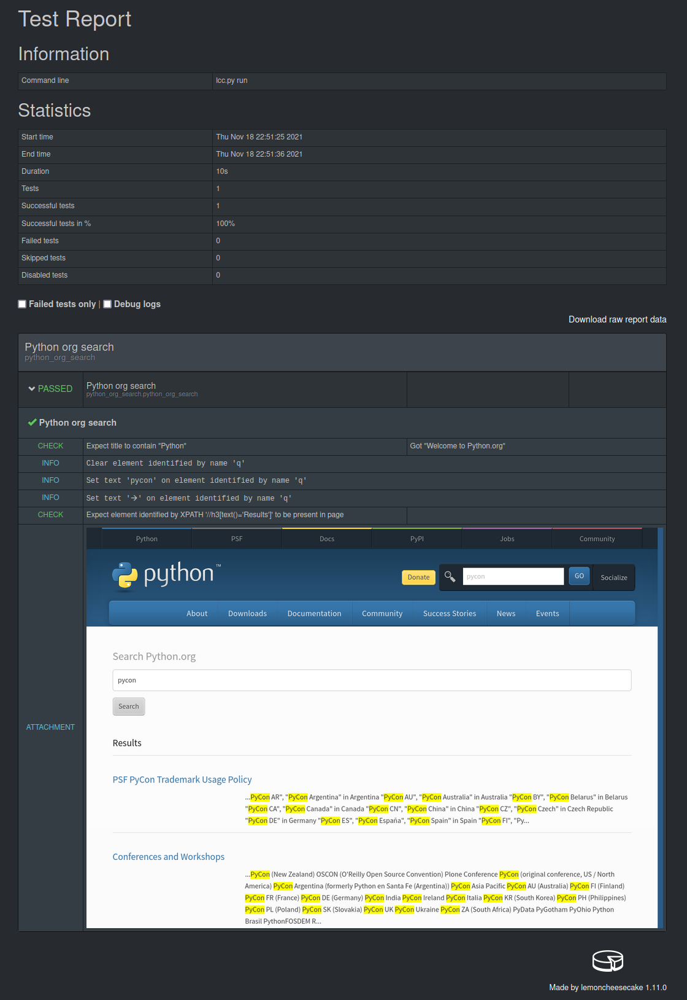

.. lemoncheesecake-selenium documentation master file, created by
   sphinx-quickstart on Sun Aug 22 12:49:56 2021.
   You can adapt this file completely to your liking, but it should at least
   contain the root `toctree` directive.

.. _`index`:

lemoncheesecake-selenium
========================

lemoncheesecake-selenium provides logging facilities to the `Python Selenium library <https://selenium-python.readthedocs.io/>`_
for tests written with the `lemoncheesecake <http://lemoncheesecake.io>`_ test framework.

Here is a usage example based on the `getting started example <https://selenium-python.readthedocs.io/getting-started.html>`_
of the Selenium Python Binding (unofficial) documentation::

   # suites/python_org_search.py

   import lemoncheesecake.api as lcc
   from lemoncheesecake.matching import *
   from lemoncheesecake_selenium import Selector, save_screenshot, is_in_page
   from selenium import webdriver
   from selenium.webdriver.common.keys import Keys

   @lcc.test()
   def python_org_search():
       driver = webdriver.Firefox()
       driver.implicitly_wait(10)
       driver.get("http://www.python.org")
       selector = Selector(driver)
       check_that("title", driver.title, contains_string("Python"))
       search_field = selector.by_name("q")
       search_field.clear()
       search_field.set_text("pycon")
       search_field.set_text(Keys.RETURN)
       selector.by_xpath("//h3[text()='Results']").check_element(is_in_page())
       save_screenshot(driver)
       driver.close()

We run the test::

   $ lcc.py run
   ============================== python_org_search ==============================
    OK  1 # python_org_search.python_org_search

   Statistics :
    * Duration: 10s
    * Tests: 1
    * Successes: 1 (100%)
    * Failures: 0

   HTML report : file:///tmp/python_org_search/report/report.html

And here are the report details :

Installation
------------

Install through pip::

   $ pip install lemoncheesecake-selenium

lemoncheesecake-selenium is compatible with Python 3.7-3.10 and Selenium 4.x.

Introduction
------------

The main feature of the library is to provide a layer above Selenium's ``WebElement``
that will log the interactions performed on the element (such as clicking, entering text, etc...) and allow various
checking operations (such as verifying the existence of the element, doing matching operations on the DOM node's text,
etc...), this is the job of the :py:class:`Selection <lemoncheesecake_selenium.Selection>` class.

:py:class:`Selection <lemoncheesecake_selenium.Selection>` instances are obtained through the
:py:class:`Selector <lemoncheesecake_selenium.Selector>` class
which acts like a ``Selection`` factory. A ``Selector`` instance mirrors the Selenium's
`By <https://selenium-python.readthedocs.io/api.html#locate-elements-by>`_ class such as:

- :py:func:`Selector.by_id <lemoncheesecake_selenium.Selector.by_id>` will build a ``Selection`` using the ``By.ID`` locator strategy

- :py:func:`Selector.by_xpath <lemoncheesecake_selenium.Selector.by_xpath>` will build a ``Selection`` using the ``By.XPATH`` locator strategy

- ... and this for every locator strategy of ``By``

Interacting with elements
-------------------------

With :py:class:`Selection <lemoncheesecake_selenium.Selection>` you can
:py:func:`click <lemoncheesecake_selenium.Selection.click>`,
:py:func:`clear <lemoncheesecake_selenium.Selection.clear>` or
:py:func:`set_text <lemoncheesecake_selenium.Selection.set_text>` (equivalent of Selenium's ``send_keys``) the element::

   selection.set_text("hello")

You can also directly interact with a SELECT element, using the same ``select_*`` and ``deselect_*`` methods as the
Selenium's
:py:class:`Select <selenium.webdriver.support.select.Select>` class with methods such as
:py:func:`select_by_value <lemoncheesecake_selenium.Selection.select_by_value>`,
:py:func:`select_by_index <lemoncheesecake_selenium.Selection.select_by_index>`, etc...::

   selection.select_by_index(2)

If anything wrong happens (the ``WebElement`` cannot be found, the requested interaction is not possible on that
element, etc..),
the underlying Selenium's exception will be propagated by the ``Selection`` method that has been called.
You can choose to automatically take a screenshot of the web page when this is happening by setting the CLASS attribute
:py:attr:`Selection.screenshot_on_exceptions <lemoncheesecake_selenium.Selection.screenshot_on_exceptions>` to ``True``
(meaning that this behavior will be applied to ``Selection`` instances)::

   Selection.screenshot_on_exceptions = True

Checking elements
-----------------

The :py:class:`Selection <lemoncheesecake_selenium.Selection>` allows you to do checks on the underlying element using
`the same check/require/assert scheme as lemoncheesecake <http://docs.lemoncheesecake.io/en/latest/matchers.html#the-matching-operations>`_
with the methods:

- :py:func:`check_element(expected) <lemoncheesecake_selenium.Selection.check_element>`
- :py:func:`require_element(expected) <lemoncheesecake_selenium.Selection.require_element>`
- :py:func:`assert_element(expected) <lemoncheesecake_selenium.Selection.assert_element>`

where ``expected`` is a :py:class:`Matcher <lemoncheesecake.matching.Matcher>` instance whose ``matches`` method will
take a ``WebElement`` as argument. lemoncheesecake-selenium provides the following built-in matcher functions:

- :py:func:`is_in_page() <lemoncheesecake_selenium.is_in_page>`
- :py:func:`has_text(expected) <lemoncheesecake_selenium.has_text>`
- :py:func:`has_attribute(name[, value_matcher]) <lemoncheesecake_selenium.has_attribute>`
- :py:func:`has_property(name[, value_matcher]) <lemoncheesecake_selenium.has_property>`
- :py:func:`is_displayed() <lemoncheesecake_selenium.is_displayed>`
- :py:func:`is_enabled() <lemoncheesecake_selenium.is_enabled>`
- :py:func:`is_selected() <lemoncheesecake_selenium.is_selected>`

Examples::

   selection.check_element(is_in_page())
   selection.check_element(has_text(match_pattern(r"(\d)€")))
   selection.check_element(has_attribute("class"))
   selection.check_element(has_attribute("class", equal_to("enabled)))
   selection.check_element(has_property("text_length"))
   selection.check_element(has_property("text_length", equal_to(8)))
   selection.check_element(is_displayed())
   selection.check_element(is_enabled())
   selection.check_element(not_(is_enabled()))
   selection.check_element(is_selected())

You can also check for the non-existence of an element through the following ``Selection`` methods:

- :py:func:`check_no_element() <lemoncheesecake_selenium.Selection.check_no_element>`
- :py:func:`require_no_element() <lemoncheesecake_selenium.Selection.require_no_element>`
- :py:func:`assert_no_element() <lemoncheesecake_selenium.Selection.assert_no_element>`

Example::

   selection.require_no_element()

It is possible to automatically take a screenshot on failed checks (either it's done by a ``check_*``, ``require_*`` or
``assert_*`` method) by setting the CLASS attribute
:py:attr:`Selection.screenshot_on_failed_checks <lemoncheesecake_selenium.Selection.screenshot_on_failed_checks>` to ``True``
(also meaning that this behavior will be applied to ``Selection`` instances)::

   Selection.screenshot_on_failed_checks = True

Explicit waits / Expected condition
-----------------------------------

lemoncheesecake-selenium provides support for
the `explicit waits / expected condition <https://selenium-python.readthedocs.io/waits.html#explicit-waits>`_
mechanism of Selenium with the following ``Selection`` methods:

- :py:func:`must_be_waited_until() <lemoncheesecake_selenium.Selection.must_be_waited_until>`
- :py:func:`must_be_waited_until_not() <lemoncheesecake_selenium.Selection.must_be_waited_until_not>`

Examples::

   selection.must_be_waited_until(EC.element_to_be_clickable)
   selection.must_be_waited_until_not(EC.visibility_of_element_located, timeout=10)

These two methods assume that the expected condition callable passed in argument takes a ``locator`` as first argument.

Making screenshots
------------------

Beyond the ``Selection.screenshot_on_*`` attributes described above, you can also make explicit screenshots with
the :py:func:`save_screenshot <lemoncheesecake_selenium.save_screenshot>` function::

   from lemoncheesecake_selenium import ..., save_screenshot
   [...]
   save_screenshot(driver)

You can also use the :py:func:`save_screenshot_on_exception <lemoncheesecake_selenium.save_screenshot_on_exception>`
context manager to make a screenshot when a ``WebDriverException`` exception occurs::

   from lemoncheesecake_selenium import ..., save_screenshot_on_exception
   [...]
   with save_screenshot_on_exception(driver):
      [... your code here ...]

Page Object Model (POM)
-----------------------

While lemoncheesecake-selenium does not enforce any design pattern, it plays pretty well with the
`Page Object Model (POM) <https://www.browserstack.com/guide/page-object-model-in-selenium>`_ design pattern.

Here is how the initial example could be rewritten using this design pattern::

   # suites/python_org_search_pom.py

   import lemoncheesecake.api as lcc
   from lemoncheesecake.matching import *
   from lemoncheesecake_selenium import Selector, save_screenshot, is_in_page
   from selenium import webdriver
   from selenium.webdriver.common.keys import Keys

   class SearchPage(Selector):
       @property
       def search_field(self):
           return self.by_name("q")

       def search(self, value):
           field = self.search_field
           field.clear()
           field.set_text(value)
           field.set_text(Keys.RETURN)
           return ResultsPage(self.driver)

   class ResultsPage(Selector):
       @property
       def results_header(self):
           return self.by_xpath("//h3[text()='Results']")

   @lcc.test()
   def python_org_search():
       driver = webdriver.Firefox()
       driver.implicitly_wait(10)
       driver.get("http://www.python.org")

       check_that("title", driver.title, contains_string("Python"))
       search_page = SearchPage(driver)
       results_page = search_page.search("pycon")
       results_page.results_header.check_element(is_in_page())
       save_screenshot(driver)

       driver.close()

Changelog
---------

The |location_link| will tell you about features, improvements and fixes of each version.

.. |location_link| raw:: html

   <a href="https://github.com/lemoncheesecake/lemoncheesecake-selenium/blob/master/CHANGELOG.md" target="_blank">Changelog</a>
